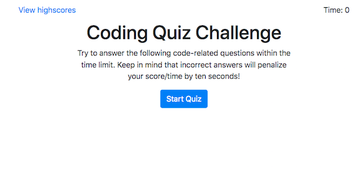

# Web APIs: Code Quiz

You can see the deployed app [here](https://paulthomas0824.github.io/coding-quiz/).

## Table of Contents
* [Description](#description)
* [Installation](#installation)
* [Usage](#usage)
* [Credits](#credits)
* [License](#license)
* [Badges](#badges)

## Description
In this timed quiz, you can test your knowledge of command line, HTML, CSS, and JavaScript fundamentals with multiple choice questions. The quiz itself features dynamically updated HTML and CSS powered by JavaScript. You can save your score and see your progress over time by viewing previous attempts as well. CAREFUL! If you get a question wrong, time is subtracted from the clock.

Further development could include the ability to shuffle the order of the questions and answer choices.
